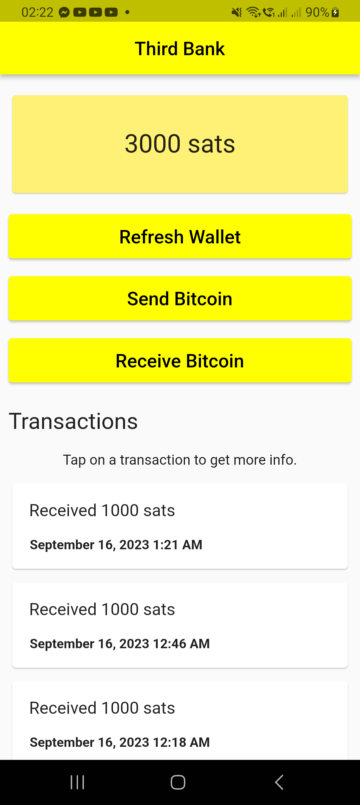
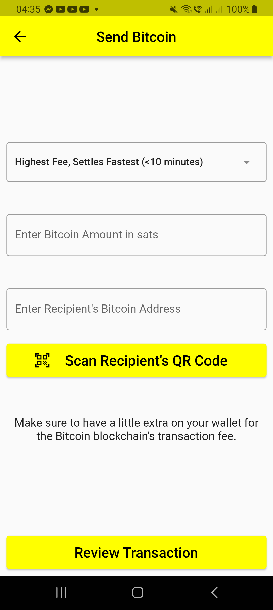

# Third Bank

Download the latest APK from the [Releases Section](https://github.com/aldrinzigmundv/thirdbank/releases/latest)

## What is Third Bank?

A free and open-source experimental non-custodial Bitcoin wallet that focuses on simplicity and ease of use.

## Features
* Free, open-source and non-custodial
* Intuitive and easy-to-navigate interface design
* Easily lock the app with your phone's PIN or biometrics during setup
* Effortlessly scan QR codes to send Bitcoin to another address

## Inspiration

I developed this app after working for a smart TV manufacturer and receiving a lot of feedback from elderly customers who were having difficulty operating their smart TVs, which in my opinion are really far from being user-friendly. I believe we have transitioned from making technology user-friendly for everyone to focusing on aesthetics, often resulting in designs that appear impressive but can be overwhelming for others. This app is my attempt to create a Bitcoin wallet for those people.

## Warning

Please be aware that this application is still in its early stages of development and there is a possibility of losing all your funds. Therefore, it's important to exercise caution, use the app at your own discretion, and refrain from holding significant amounts of funds within the app due to the said risk.

I have yet to work on refactoring the code, adding comments for better readability, and improving the overall organization of the project but will definitely work on it soon.

You can contribute in various ways: by identifying and reporting issues, submitting pull requests on GitHub, or by showing support through a donation using the Bitcoin wallet address provided below.

## Donate

Donate BTC to Support this App

bc1qruus6vnxrww6pqac3hvg6vsepmqv8d66dwjm59